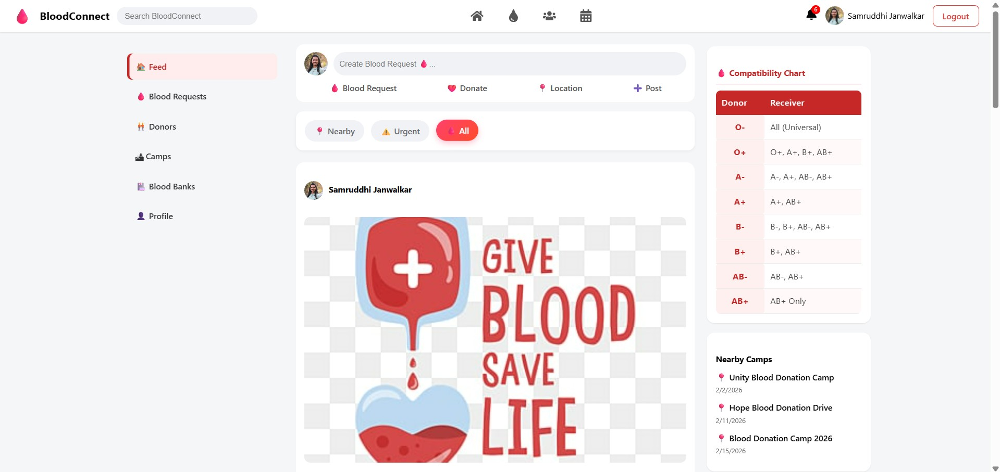
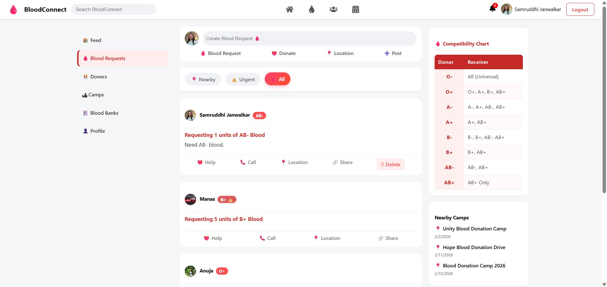
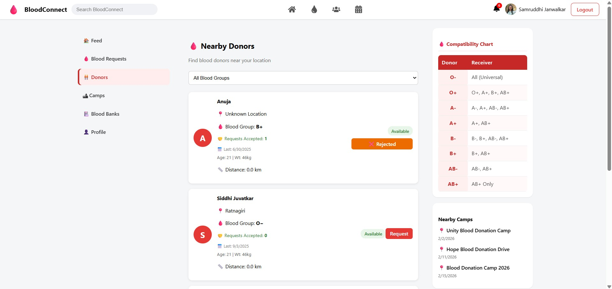
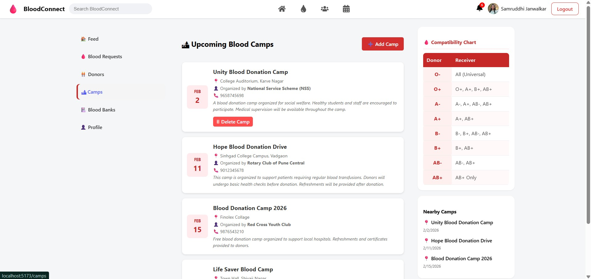
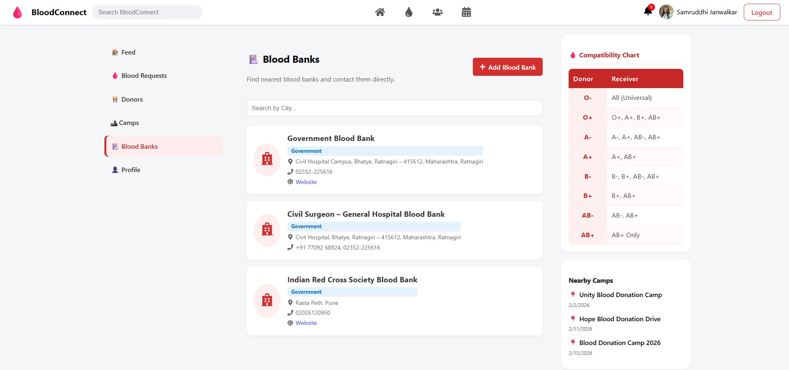

# 🩸 BloodConnect - Social Blood Donation Platform

🚀 BloodConnect is a full-stack web application designed to connect blood donors with recipients efficiently and quickly, helping save lives through technology.

---

## 📌 Project Overview

BloodConnect allows users to:
- Register as blood donors
- Search for available donors
- Connect donors with recipients in real-time

This project was developed during my internship at **Aaryak Solutions Pvt. Ltd., Ratnagiri**, where I worked as a Trainee Software Developer.

---

## 💼 Internship Experience

- 🏢 Company: Aaryak Solutions Pvt. Ltd.
- 👩‍💻 Role: Trainee Software Developer
- 📅 Duration: Dec 2025 – Jan 2026

During this internship, I worked on **BloodConnect: A Social Blood Donation Platform** and was involved in multiple phases of the Software Development Life Cycle (SDLC).

---

## 🛠️ Tech Stack

### Frontend:
- React (Vite)
- CSS

### Backend:
- Node.js
- Express.js

### Database:
- MongoDB

---

## ✨ Features

- 🔐 User Authentication System
- 🔍 Search Blood Donors
- 📊 Donor Availability Tracking
- 💻 Responsive UI
- 🔗 Full-stack Integration

---
## 📸 Screenshots

## 📸 Screenshots

### 🏠 Dashboard

  

### 🩸 Blood Requests

  

### 👥 Donors

  

### 🏕️ Camps

  

### 🏥 Blood Banks

  

## 📁 Project Structure
